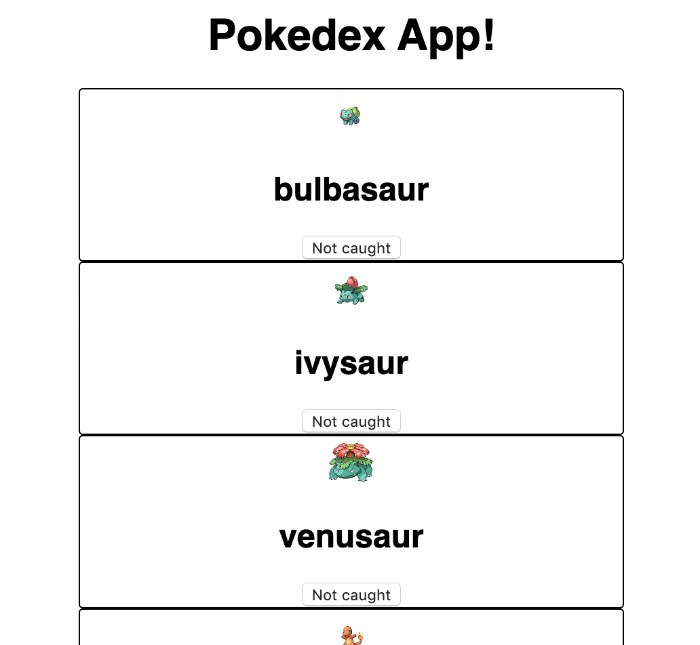

# Web Components from Zero to Hero Workshop

## Slides

- [Preworkshop slides](https://docs.google.com/presentation/d/1Jo9mqdCBkaHSN6AYj_iroGHJ7Ag3-tXrJJncpFXDRFM/edit?usp=sharing)
- [Lunchspiration](https://docs.google.com/presentation/d/1Pi5nvFcmQlfksIp3m4XhMqvmi0RHqvppoi-se_9F7fg/edit?usp=sharing)

## Requirements

- 🚨 The latest version of Chrome (We'll be making use of some cutting edge browser standards)
- _Some_ basic knowledge of Web Components 
- _Some_ knowledge of the [fetch API](https://developer.mozilla.org/en-US/docs/Web/API/Fetch_API/Using_Fetch) and async javascript

For this workshop you won't need to use `npm` or  install any dependencies, we'll load the only two dependencies from a [CDN](https://unpkg.com). Everything else will simply be handled by the browser!

## Getting Started

Simply **clone** the repo on your machine, and start with `./assignments/1_vanilla_pokedex.html`. You can just **double-click the file and open them in your browser**. The assignment will be explained to you in the file. 

Each file has **the assignment written down as a comment**, you don't have to start working in a new file everytime you completed an assignment, but do **make sure to check the files out thoroughly**, there may be a hint or even some **pre-written code snippets**!

When you get stuck, you can ask the instructors, or take a look at the `./solutions/` directory.

## What are we building?

We'll be building a very basic **pokedex app**. The way we'll go about this is, we'll build it in **three iterations**.



### Part 1: Native Web Components

We'll first build it with native web components and really **feel the pain of writing boilerplate code** like getters and setters, using imperative DOM apis like `document.createElement`, and using `.innerHTML`.

### Part 2: Lit-html

We'll then refactor our native web component to use [lit-html](https://lit-html.polymer-project.org/) for rendering, and make our code _declarative_. In this phase we'll be able to **remove a lot of the imperative code** we wrote in the first phase.

### Part 3: LitElement

We'll then refactor entirely to use [LitElement](https://lit-element.polymer-project.org/) instead, and become a web component hero. LitElement will make _many_ things _that much_ easier for us, and you'll figure out soon enough why.

## High level overview

We'll build two web components:

### `<pokedex-app>`

- Should `fetch()` a list of 20 pokemon from the [pokedex api](https://pokeapi.co) in the `connectedCallback()`, specifically: `https://pokeapi.co/api/v2/pokemon`, this will return something like this:
```json
{
    "count": 964,
    "next": "https://pokeapi.co/api/v2/pokemon?offset=20&limit=20",
    "previous": null,
    "results": [
        {
            "name": "bulbasaur",
            "url": "https://pokeapi.co/api/v2/pokemon/1/"
        },
        {
            "name": "ivysaur",
            "url": "https://pokeapi.co/api/v2/pokemon/2/"
        },
    ]
}
```

- Have a `_renderPokemon(listOfPokemon)` method that creates a new `pokemon-card` web component for **every pokemon we just fetched**, with a `name` attribute and a `.url` property, and renders them to our `<pokedex-app>`s `shadowRoot`

### `<pokemon-card>`

- Should fetch some **additional information** about each specific pokemon using the `.url` property, the call should be done in the `connectedCallback()`. The url will look like this, and should be passed down **from the parent component**: `https://pokeapi.co/api/v2/pokemon/2/`

- Should have **setters/getters** for the `.url` property and `name` attribute

- Should **render an image of the current pokemon** (fetched by the pokeapi), and a **h2 header with the name of the pokemon**

## Useful Links

### General

- [LitElement/lit-html code examples](https://open-wc.org/developing/code-examples.html) - Not sure how to do something with LitElement/lit-html? Check out these code snippets
- [Pokedex api](https://pokeapi.co) - Pokedex api
- [Web Components from Zero to Hero blog](https://dev.to/thepassle/web-components-from-zero-to-hero-4n4m) - The original blog, you may find some useful information about web components in here.
- [lit-html documentation](https://lit-html.polymer-project.org) 
- [LitElement documentation](https://lit-element.polymer-project.org)

### APIs

- [fetch api](https://developer.mozilla.org/en-US/docs/Web/API/Fetch_API/Using_Fetch) - How to use the fetch API
- [Constructable StyleSheets](https://developers.google.com/web/updates/2019/02/constructable-stylesheets) - How to use constructable stylesheets
- [async/await](https://developer.mozilla.org/en-US/docs/Web/JavaScript/Reference/Statements/async_function) - How to use the async/await keywords
- [\<template\> tag](https://developer.mozilla.org/en-US/docs/Web/Web_Components/Using_templates_and_slots#Using_templates_with_web_components) - How to use html `<template>`s
- [Web Component lifecycle](https://developer.mozilla.org/en-US/docs/Web/Web_Components/Using_custom_elements#Using_the_lifecycle_callbacks) - All about a web component's lifecycle
- [ES6 Class Syntax](https://coryrylan.com/blog/javascript-es6-class-syntax) - All about ES6 class syntax like getters and setters
